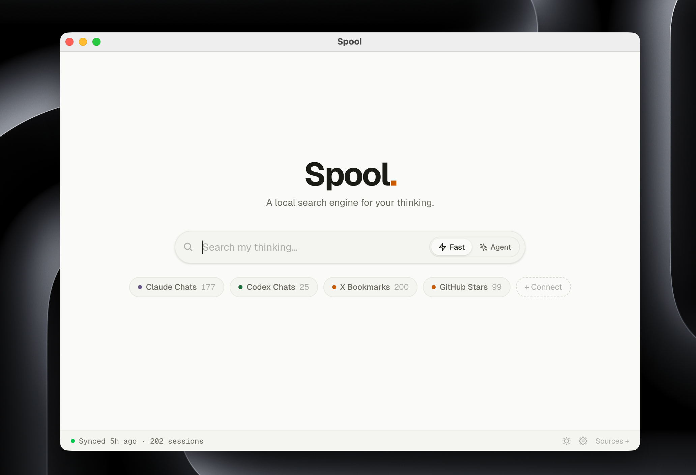

# Spool

The missing search engine for your own data.

<p align="center">
  
</p>

Search your Claude Code sessions, Codex CLI history, GitHub stars, Twitter bookmarks, and YouTube likes — locally, instantly.

> **Early stage.** Spool is under active development — expect rough edges. Feedback, bug reports, and ideas are very welcome via [Issues](https://github.com/spool-lab/spool/issues) or [Discord](https://discord.gg/aqeDxQUs5E).

## Install

Download the latest `.dmg` from [Releases](https://github.com/spool-lab/spool/releases/latest). Apple Silicon only.

Or build from source:

```bash
pnpm install
pnpm build
# DMG is in packages/app/dist/
```

## What it does

Spool indexes your AI conversations and bookmarks into a single local search box.

- **AI sessions** — watches `~/.claude/` and `~/.codex/` in real time
- **Bookmarks & stars** — pulls from 50+ platforms via [OpenCLI](https://github.com/jackwener/opencli)
- **URL capture** — save any URL with `Cmd+K`
- **Agent search** — a `/spool` skill inside Claude Code feeds matching fragments back into your conversation

Everything stays on your machine. Nothing leaves.

## Architecture

```
packages/
  app/      Electron macOS app (React + Vite + Tailwind)
  core/     Indexing engine (SQLite + FTS5)
  cli/      CLI interface (`spool search ...`)
  landing/  spool.pro website
```

## Development

```bash
pnpm install
pnpm dev          # starts app + landing in dev mode
pnpm test         # runs all tests
```

## Release

```bash
./scripts/release.sh        # bump version, build, create GitHub release
```

## License

MIT
